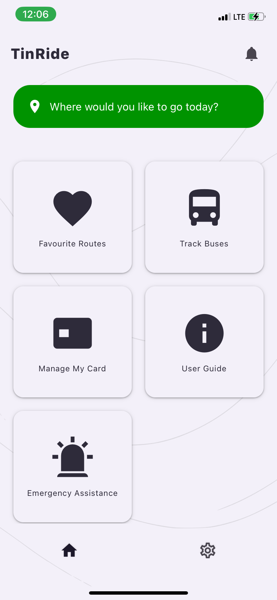
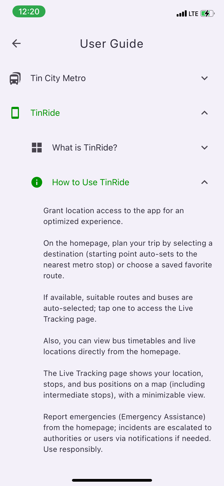
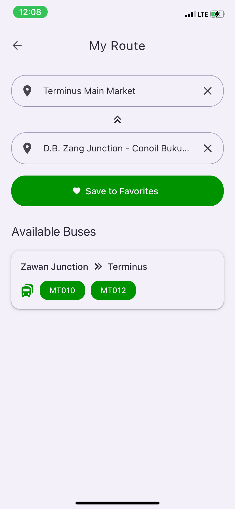
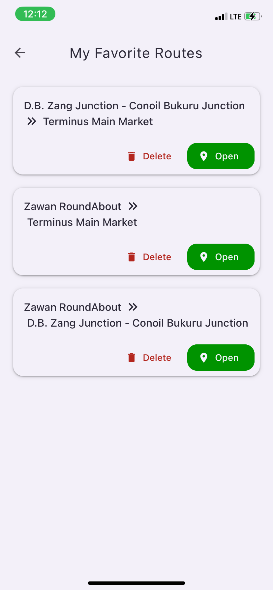
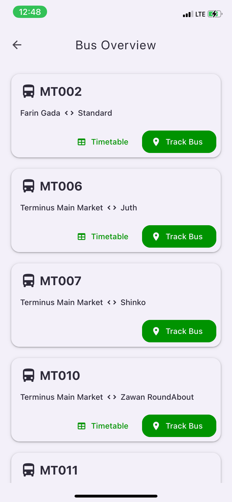
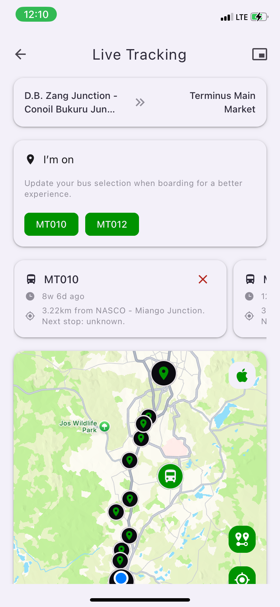
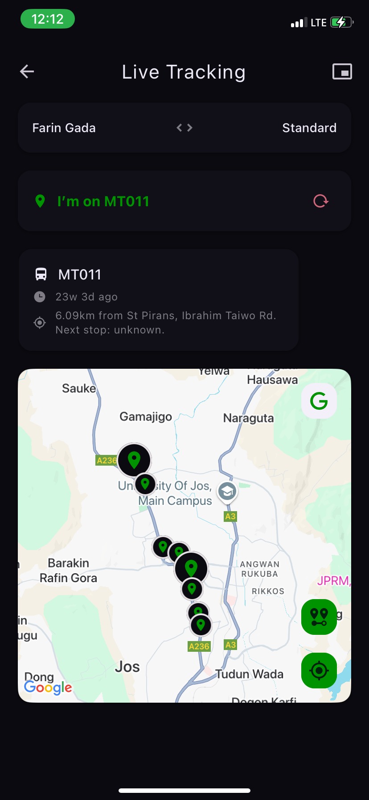
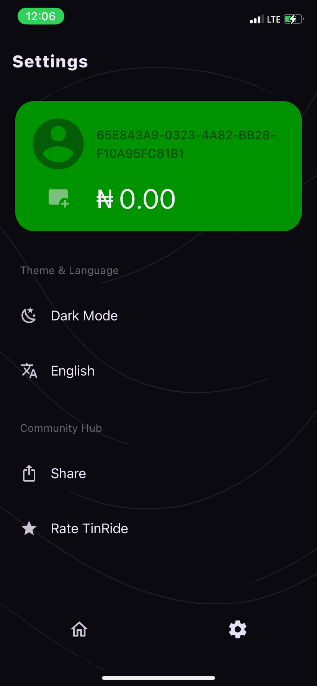
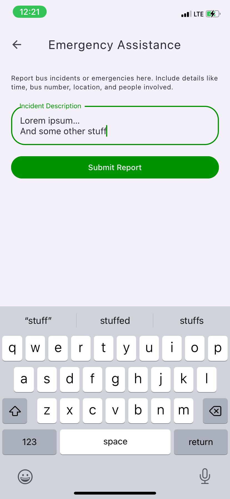
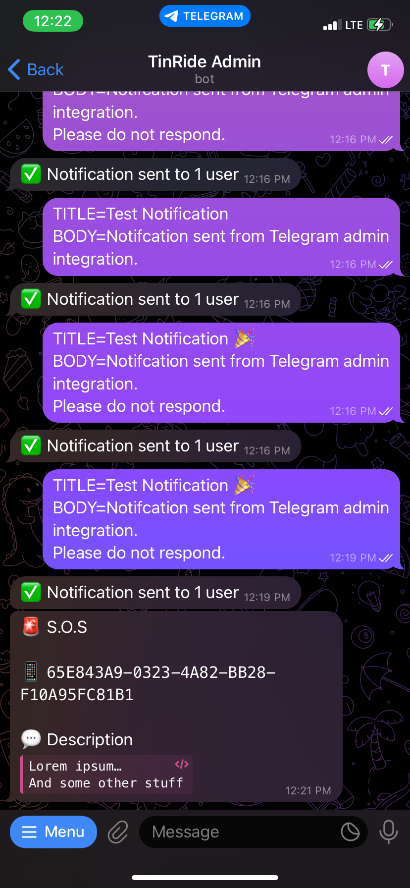

# TinRide - Public Demo

Welcome to the public demo repository for TinRide, a mobile application developed by Gbiang Benedict Mashingil. TinRide is an innovative, offline-first public transport utility app designed to enhance the experience of using Tin City Metro in Jos, Plateau State, Nigeria. This repository provides an overview, built files (APK and IPA), and screenshots for demonstration purposes.

---

## Overview

TinRide is a free, user-friendly app that simplifies navigation and management of the Tin City Metro bus system. Built with a focus on accessibility in regions with limited internet, it operates offline-first (except for live tracking), making it ideal for users where connectivity can be inconsistent.

### Key Features

- **Offline-First Design**: Plan trips, access timetables, and view maps without internet (live tracking requires connectivity).
- **Live Tracking**: Real-time bus locations with a last-updated timestamp for reliability.
- **Interactive Maps**: Supports Google and Apple Maps with zoom options (journey region, street view), marking user location, buses, and stops.
- **Trip Planning**: Auto-selects routes and buses, with saveable favorite routes.
- **Emergency Assistance**: Report incidents with escalation to authorities or users.
- **Metro Card Management**: Purchase, recharge, and monitor cards (real-time balance feature coming soon).
- **Localization**: Available in English and other popular/native languages spoken in the city, with a user-friendly interface (Light/Dark Mode).

---

## Built Files

- **Android APK**: [Download TinRide Preview APK](https://drive.google.com/file/d/1H5OfSw-RFu8Mw5yT7yTQJpxJoQOJJjuG/view?usp=sharing) to install on compatible Android devices for a hands-on demo.
<!-- - **iOS Simulator**: [Download TinRide Preview](https://drive.google.com/file/d/1pS7nlKJlMir73oZrzcPiwj9y5aUpKE7b/view?usp=sharing) to install on a compatible iOS simulator or test environment (e.g., Xcode). -->

**Note:** Ensure your device allows installation from unknown sources for APK, and use a provisioning profile for IPA.

---

## Screenshots

### Homepage - User Guide

  
  

### Trip Planning - Favourite Routes - Buses - Timetable

  
  
  
  

### Live Tracking - Settings

  
  
  

### Emergency Assistance (In-App and Telegram Admin)

  
  

---

## Technical Details

### Server

- **Framework**: Built with Express.js (TypeScript).
- **Database**: Utilizes MySQL for data storage.
- **Real-Time Communication**: Powered by Socket.IO and Expo Server SDK for notifications.

### App

- **Framework**: Developed with Expo (React Native).
- **Libraries**: Integrates react-native-maps, socket.io-client, and i18n-js for localization.

---

## Contribution, Partnership, and Contact

This is a demo repository with built files only. For inquiries, feedback, or partnership opportunities, please contact:

**Gbiang Benedict Mashingil**  
📧 Email: [gbiangb@gmail.com](mailto:gbiangb@gmail.com)

---

## License

© 2025 Gbiang Benedict Mashingil. All rights reserved.  
This demo is for exhibition purposes only.